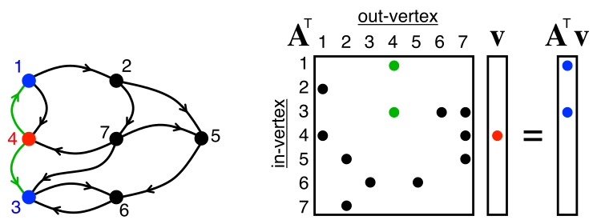

# SuiteSparseGraphBLAS.jl

SuiteSparseGraphBLAS.jl is a package for sparse linear algebra on arbitrary semirings, with a particular focus on graph computations.
It aims to provide a Julian wrapper over Tim Davis' SuiteSparse reference implementation of the GraphBLAS C specification.

# Roadmap

!!! note
    This library is still a WIP, if you are missing any functionality, find any incorrectly implemented functions, or need further/better documentation please open an issue, PR, or ask in the [#GraphBLAS channel on the Julia Zulip](https://julialang.zulipchat.com/#narrow/stream/289264-GraphBLAS) (preferred) or the [#graphblas channel on the Julia Slack](https://julialang.slack.com/archives/C023B0WGMHR)!

While the core library is mostly complete, and all GraphBLAS functionality is present, there are still quite a few features being worked on for v1.0:

1. ChainRules.jl integration for AD.
2. Complete SparseArrays and ArrayInterface interfaces.
3. Fancy printing
4. User-defined types.
5. Alternative syntax for GraphBLAS ops (currently must use `BinaryOps.PLUS` instead of `+`).

Once these are completed there will be a v1.0 release, with the goal being JuliaCon 2021.

Post 1.0 goals include:

1. LightGraphs integration.
2. GeometricFlux or other graph machine learning framework integration.
3. More efficient import and export between Julia and GraphBLAS
4. Support for other GraphBLAS implementations in a follow-up GraphBLAS.jl

# Installation

Install using the Julia package manager in the REPL:

```
] add SuiteSparseGraphBLAS
```

or with `Pkg`

```
using Pkg
Pkg.add("SuiteSparseGraphBLAS")
```

The SuiteSparse:GraphBLAS binary is installed automatically as `SSGraphBLAS_jll`.

# Introduction

GraphBLAS harnesses the well-understood duality between graphs and matrices.
Specifically a graph can be represented by its [adjacency matrix](https://en.wikipedia.org/wiki/Adjacency_matrix), [incidence matrix](https://en.wikipedia.org/wiki/Incidence_matrix), or the many variations on those formats. 
With this matrix representation in hand we have a method to operate on the graph using linear algebra operations on the matrix.

Below is an example of the adjacency matrix of a directed graph, and finding the neighbors of a single vertex using basic matrix-vector multiplication on the arithemtic semiring.



# GraphBLAS Concepts

The three primary components of GraphBLAS are: matrices, operators, and operations. Operators include monoids, binary operators, and semirings. Operations include the typical linear algebraic operations like matrix multiplication as well as indexing operations.

## GBArrays

SuiteSparseGraphBLAS.jl provides `GBVector` and `GBMatrix` array types which are subtypes of `SparseArrays.AbstractSparseVector` and `SparseArrays.AbstractSparseMatrix` respectively. Both can be constructed with no arguments to use the maximum size.

```@setup intro
using SuiteSparseGraphBLAS
using SparseArrays
```

```@repl intro
GBVector{Float64}()

GBMatrix{ComplexF64}()
```

GraphBLAS array types are opaque to the user in order to allow the library author to choose the best storage format.
SuiteSparse:GraphBLAS takes advantage of this by storing matrices in one of four formats: dense, bitmap, sparse-compressed, or hypersparse-compressed; and in either row or column major orientation.
SuiteSparseGraphBLAS.jl sets the default to column major to ensure fast imports and exports.

A complete list of construction methods can be found in [Construction](@ref), but the matrix and vector above can be constructed as follows:

```@repl intro
A = GBMatrix([1,1,2,2,3,4,4,5,6,7,7,7], [2,4,5,7,6,1,3,6,3,3,4,5], [1:12...])

v = GBVector([4], [10])
```
## GraphBLAS Operations

The complete documentation of supported operations can be found in [Operations](@ref).
GraphBLAS operations are, where possible, methods of existing Julia functions  listed in the third column.

| GraphBLAS           | Operation                                                        | Julia                                   |
|:--------------------|:----------------------------------------:                        |----------:                              |
|`mxm`, `mxv`, `vxm`  |``\bf C \langle M \rangle = C \odot AB``                          |`mul[!]`                                 |
|`eWiseMult`          |``\bf C \langle M \rangle = C \odot (A \otimes B)``               |`emul[!]`                                |
|`eWiseAdd`           |``\bf C \langle M \rangle = C \odot (A \oplus  B)``               |`eadd[!]`                                |
|`extract`            |``\bf C \langle M \rangle = C \odot A(I,J)``                      |`extract[!]`, `getindex`                 |
|`subassign`          |``\bf C (I,J) \langle M \rangle = C(I,J) \odot A``                |`subassign[!]`, `setindex!`              |
|`assign`             |``\bf C \langle M \rangle (I,J) = C(I,J) \odot A``                |`assign[!]`                              |
|`apply`              |``{\bf C \langle M \rangle = C \odot} f{\bf (A)}``                |`map[!]`                                 |
|                     |``{\bf C \langle M \rangle = C \odot} f({\bf A},y)``              |                                         |
|                     |``{\bf C \langle M \rangle = C \odot} f(x,{\bf A})``              |                                         |
|`select`             |``{\bf C \langle M \rangle = C \odot} f({\bf A},k)``              |`select[!]`                              |
|`reduce`             |``{\bf w \langle m \rangle = w \odot} [{\oplus}_j {\bf A}(:,j)]`` |`reduce[!]`                              |
|                     |``s = s \odot [{\oplus}_{ij}  {\bf A}(i,j)]``                     |                                         |
|`transpose`          |``\bf C \langle M \rangle = C \odot A^{\sf T}``                   |`gbtranspose[!]`, lazy: `transpose`, `'` |
|`kronecker`          |``\bf C \langle M \rangle = C \odot \text{kron}(A, B)``           |`kron[!]`                                |

where ``\bf M`` is a `GBArray` mask, ``\odot`` is a binary operator for accumulating into ``\bf C``, and ``\otimes`` and ``\oplus`` are a binary operation and commutative monoid respectively. 

## GraphBLAS Operators

GraphBLAS operators are one of the following:

- `UnaryOps` such as `SIN`, `SQRT`, `ABS`, ...
- `BinaryOps` such as `GE`, `MAX`, `POW`, `FIRSTJ`, ...
- `Monoids` such as `PLUS_MONOID`, `LXOR_MONOID`, ...
- `Semirings` such as `PLUS_TIMES` (the arithmetic semiring), `MAX_PLUS` (a tropical semiring), `PLUS_PLUS`, ...

Built-in operators can be found in exported submodules:

```julia
julia> BinaryOps.\TAB

ANY       BSET       DIV        FIRSTJ1    ISGE       LDEXP      MIN        RDIV       SECONDJ
ATAN2     BSHIFT     EQ         FMOD       ISGT       LE         MINUS      REMAINDER  SECONDJ1
BAND      BXNOR      FIRST      GE         ISLE       LOR        NE         RMINUS     TIMES
BCLR      BXOR       FIRSTI     GT         ISLT       LT         PAIR       SECOND
BGET      CMPLX      FIRSTI1    HYPOT      ISNE       LXOR       PLUS       SECONDI
BOR       COPYSIGN   FIRSTJ     ISEQ       LAND       MAX        POW        SECONDI1
```

## Example

Here is an example of two different methods of triangle counting with GraphBLAS.
The methods are drawn from the LAGraph [repo](https://github.com/GraphBLAS/LAGraph).

Input `A` must be a square, symmetric matrix with any element type.
We'll test it using the matrix from the GBArray section above, which has two triangles in its undirected form.

```@repl intro
function cohen(A)
  U = select(TRIU, A)
  L = select(TRIL, A)
  return reduce(Monoids.PLUS_MONOID[Int64], mul(L, U, Semirings.PLUS_PAIR; mask=A)) ÷ 2
end

function sandia(A)
  L = select(TRIL, A)
  return reduce(Monoids.PLUS_MONOID[Int64], mul(L, L, Semirings.PLUS_PAIR; mask=L))
end

M = eadd(A, A', BinaryOps.PLUS) #Make undirected/symmetric
cohen(M)
sandia(M)
```
